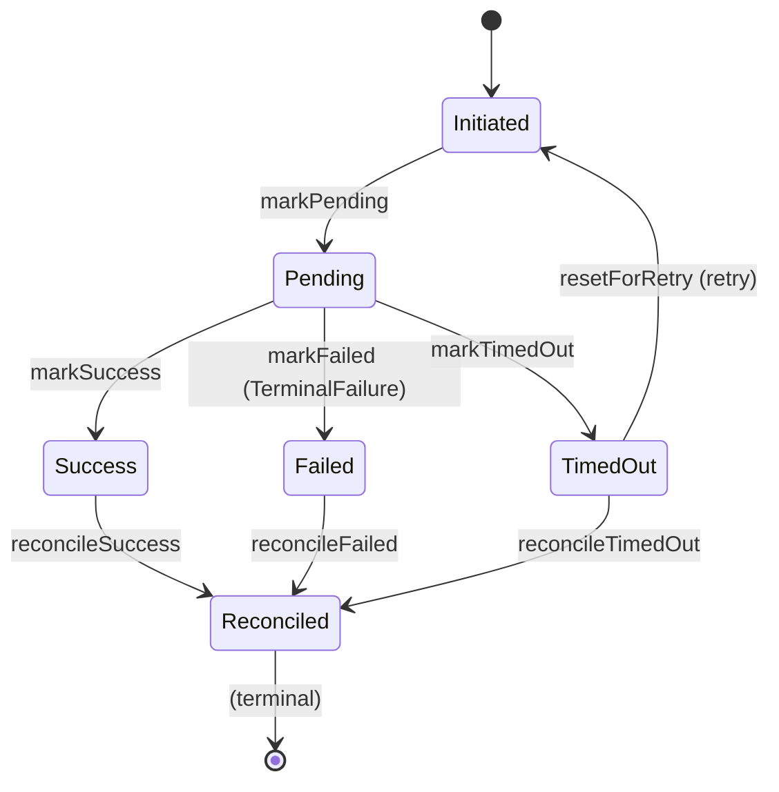

# UPI Payment Orchestration Engine

> A production-grade Haskell backend simulating UPI payment routing, retry logic, reconciliation, and an auditable ledger — demonstrating idiomatic FP patterns used in real payment infrastructure (à la Juspay/EulerHS).

## Architecture Overview

```
┌─────────────┐     ┌──────────────┐     ┌─────────────────┐
│  API Layer  │────▶│ Orchestrator │────▶│  Gateways (3)   │
│  (Servant)  │     │  (Flow)      │     │  A / B / C      │
└─────────────┘     └──────┬───────┘     └─────────────────┘
                           │
              ┌────────────┼────────────┐
              ▼            ▼            ▼
        ┌──────────┐ ┌───────────┐ ┌────────────┐
        │ Router   │ │  Retry    │ │ Persistence│
        │ (STM)    │ │ (Backoff) │ │ (SQLite)   │
        └──────────┘ └───────────┘ └────────────┘
              │                          │
              ▼                          ▼
        ┌──────────────┐          ┌──────────────┐
        │ Idempotency  │          │Reconciliation│
        │ Store (STM)  │          │  Job (async) │
        └──────────────┘          └──────────────┘
```

## Key Features

| Feature | Implementation |
|---------|----------------|
| **Type-safe state machine** | GADTs + phantom types make illegal transitions unrepresentable |
| **Failure taxonomy** | `RetryableFailure` / `TerminalFailure` — no string matching |
| **Smart routing** | Success-rate tracking via STM, fallback chain |
| **Exponential backoff** | Jitter, max attempts, idempotency-aware |
| **Audit trail** | Every transition logged as typed event |
| **Reconciliation job** | Background poller resolves pending transactions |
| **Idempotency** | At-most-once via caller-supplied keys |

## Transaction Lifecycle



**No transition out of `Reconciled`** — enforced at compile time.

## API Endpoints

| Method | Path | Description |
|--------|------|-------------|
| `POST` | `/transactions` | Initiate payment (idempotent) |
| `GET` | `/transactions/:id` | Current status |
| `POST` | `/webhook/gateway-callback` | Async gateway notification |
| `GET` | `/transactions/:id/audit` | Full event history |

### Example Request

```bash
# Initiate payment
curl -X POST http://localhost:8080/transactions \
  -H "Content-Type: application/json" \
  -d '{
    "payerVPA": "user@upi",
    "payeeVPA": "merchant@upi",
    "amount": 10000,
    "idempotencyKey": "idem-123"
  }'

# Check status
curl http://localhost:8080/transactions/<txn-id>

# Audit trail
curl http://localhost:8080/transactions/<txn-id>/audit
```

## Quick Start

```bash
# Requires: Stack (GHC 9.6.5 via LTS-22.28)
stack build          # Build
stack test           # Run property tests (Hedgehog)
stack run            # Start server on :8080
```

## Project Structure

```
src/
├── Domain/              # Core types (state machine, events, gateway)
│   ├── Transaction.hs   # GADT state machine — the heart of the system
│   ├── Events.hs        # Audit event types
│   └── Gateway.hs       # Gateway request/response/error types
├── Gateway/             # 3 mock gateways with distinct behaviors
│   ├── Class.hs         # PaymentGateway typeclass
│   ├── MockGatewayA.hs  # Fast, 95% success
│   ├── MockGatewayB.hs  # Medium, 80% success, simulates 5xx
│   └── MockGatewayC.hs  # Slow, 70% success, simulates timeouts
├── Orchestrator/        # Business logic
│   ├── Router.hs        # Gateway selection + metrics (STM)
│   ├── Retry.hs         # Backoff + idempotency checking
│   └── Flow.hs          # Main orchestration (ReaderT/ExceptT/IO)
├── Persistence/         # SQLite via persistent
│   ├── Schema.hs        # Tables: transactions, transaction_events
│   └── Repository.hs    # CRUD + queries
├── Reconciliation/      # Background job
│   └── Job.hs           # Polls pending, calls checkStatus
└── API/                 # Servant HTTP layer
    ├── Types.hs         # Request/response (separate from domain)
    ├── Routes.hs        # Type-level API spec
    └── Handlers.hs      # Handlers wired to orchestrator
```

## Tech Stack

| Layer | Libraries |
|-------|-----------|
| Web | `servant`, `servant-server`, `warp` |
| Database | `persistent`, `persistent-sqlite` |
| Concurrency | `stm`, `async` |
| Serialization | `aeson` |
| Identifiers | `uuid`, `uuid-types` |
| Testing | `hedgehog`, `tasty`, `tasty-hedgehog` |
| Numerics | `scientific` (via `Amount` newtype) |

## Testing

Property-based tests with Hedgehog:

```bash
stack test                    # All tests
stack test --ta="-p Router"   # Router properties
stack test --ta="-p Retry"    # Retry properties
stack test --ta="-p StateMachine"  # State machine properties
```

Key properties verified:
- **StateMachine**: No invalid transitions, idempotency prevents duplicates
- **Retry**: Terminal failures never retried, backoff is monotonic
- **Router**: Always returns a gateway, success-rate ranking works

## Why This Design?

- **GADT state machine**: Eliminates entire class of bugs at compile time — no "invalid state" runtime checks needed
- **Disjoint failure types**: Retry logic *cannot* accidentally retry terminal failures — the type signature prevents it
- **STM for shared state**: Lock-free, composable concurrency for router metrics, idempotency store, event log
- **MTL monad stack**: `ReaderT Env (ExceptT Error IO)` — testable, explicit effects, mirrors EulerHS Flow pattern
- **Servant type-level API**: Handlers that don't match the spec are compile errors, not runtime 404s

## License

MIT